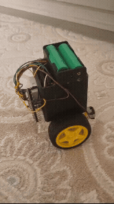

# 🤖 ESP32 Self-Balancing Robot

  

A two-wheeled inverted pendulum self-balancing robot built with an ESP32 microcontroller, MPU-6050 6-DOF IMU, L298N dual H-bridge motor driver, and classic Bluetooth Serial teleoperation.

---

## 📑 Table of Contents

- [Key Architectural Features](#-key-architectural-features)
- [Bill of Materials](#-bill-of-materials)
- [3D Printed Parts](#-3d-printed-parts)
- [Control Architecture & Dynamics](#-control-architecture--dynamics)
- [Bluetooth Remote Control](#-bluetooth-remote-control)
- [Live Serial Tuning Interface](#-live-serial-tuning-interface)
- [Hardware Wiring & Pinout](#-hardware-wiring--pinout)
- [Getting Started](#-getting-started)
- [Build Notes & Lessons Learned](#-build-notes--lessons-learned)
- [License](#-license)

---

## 📌 Key Architectural Features

- **Sensor Fusion:** 6-DOF complementary filter combining gyroscope integration with accelerometer gravity reference using dynamic loop intervals ($\Delta t$).
- **Stabilization Loop:** Discrete PID controller operating with anti-windup integral clamping ($\pm 60$) and minimum effective PWM deadband compensation (70–230 range).
- **Time-Based Teleoperation:** Bluetooth driving adjusts the target lean angle over time ($\Delta t$ ramping) instead of injecting raw motor power, preserving dynamic stability.
- **Dynamic Auto-Trim:** Rolling average feedback loop that slowly adjusts the base target angle to compensate for persistent physical steady-state drift.
- **Safety Mechanisms:** Automatic motor cutoff and controller state reset if tilt exceeds $\pm 30^\circ$ or if no valid drive command is received within the watchdog timeout.

---

## 🧰 Bill of Materials

| Qty | Component | Notes |
|:---:|:---|:---|
| 1 | **ESP32 DevKit C** | Main microcontroller |
| 2 | **TT Gear Motor** | Drive motors |
| 2 | **TT Motor Holder** | 3D printed brackets mounting each TT motor to the chassis |
| 1 | **L298N Driver** | Dual H-bridge motor driver |
| 1 | **MPU-6050** | 6-DOF IMU (accelerometer + gyroscope) |
| 2 | **18650 Li-ion Cell** | 2000–2400 mAh each, main power source (2S configuration) |
| 1 | **8×8×8 cm Enclosure** | 3D printed main chassis body with removable lid |

> **Notes on this build:**
> - The MPU-6050 is mounted directly on the enclosure's lid.
> - The chassis is an 8×8×8 cm 3D-printed box with a separate lid; the two TT motors are attached to the sides via the printed TT motor holders.
> - Add your battery holder/BMS, on/off switch, and voltage regulator (if your 2S 18650 pack doesn't match your ESP32/L298N input range) according to your own wiring.

---

## 🖨️ 3D Printed Parts

| Part | File | Status |
|:---|:---:|:---|
| **TT Motor Holder ×2** | `tt_motor_tutucu.stl` | ✅ Included in this repo |
| **8×8×8 cm Enclosure + Lid** | — | ⚠️ Designed for this build but the source/STL was lost — not yet available. If re-created, it will be added here. |

> **Suggested repo structure:** Place printable files under an `stl/` (or `hardware/`) folder so they are easy to locate separately from the firmware.

---

## 🧠 Control Architecture & Dynamics

The system maintains balance by modeling the chassis as an inverted pendulum. Balance (pitch) and steering (yaw) control are handled through separate control paths.

### 1. Angle Estimation (Complementary Filter)
$$\theta = 0.96 \cdot (\theta + \omega_{gyro} \cdot \Delta t) + 0.04 \cdot \theta_{acc}$$
Reduces high-frequency accelerometer noise while compensating for long-term gyroscope drift.

### 2. Discrete PID Formulation
$$u[k] = K_p \cdot e[k] + K_i \sum_{j=0}^{k} e[j] \Delta t_j + K_d \frac{e[k] - e[k-1]}{\Delta t_k}$$
- **Anti-Windup:** Integral accumulation is clamped within $[-60.0, 60.0]$ to limit integral windup during actuator saturation.
- **Deadband Compensation:** Overcomes DC motor static friction with conditional PWM lower bounds.

---

## 🎮 Bluetooth Remote Control

The robot hosts an SPP (Serial Port Profile) server advertised as **`DengeRobot`**. It can be controlled using apps like *Arduino Bluetooth Controller* in pad mode:

| Key | Action | Dynamic Implementation |
|:---:|:---|:---|
| **W** | Forward | Positively ramps target pitch angle (`moveTilt`) |
| **S** | Backward | Negatively ramps target pitch angle (`moveTilt`) |
| **A** | Turn Left | Offsets wheel differential (`turnBias`) negatively |
| **D** | Turn Right | Offsets wheel differential (`turnBias`) positively |
| **L** | Stop / Idle | Resets lean angle target to base balance reference |

> **Watchdog Failsafe:** If no valid command packet is received within `btTimeout` (default: 600 ms), the robot resets tilt offsets to zero.

---

## 🛠️ Live Serial Tuning Interface

PID gains and control parameters can be tuned in real time over the USB Serial Monitor (115200 baud) without recompiling:

| Command | Parameter | Description |
|:---|:---|:---|
| `p<value>` | Proportional Gain ($K_p$) | Balances corrective reaction force (default: `15.0`) |
| `i<value>` | Integral Gain ($K_i$) | Clears steady-state error & resets accumulator (default: `0.71`) |
| `d<value>` | Derivative Gain ($K_d$) | Dampens tilt vibrations & overshoots (default: `0.44`) |
| `t<value>` | Base Target Angle | Calibrates physical center-of-mass balance point |
| `a1` / `a0` | Auto-Trim Toggle | Enables/disables rolling average drift compensation |
| `m<value>` | Max Lean Angle | Sets maximum forward/backward lean tilt (deg) |
| `n<value>` | Max Turn Strength | Sets maximum turning speed bias |
| `r<value>` | Tilt Ramp Time | Acceleration ramp duration (seconds) |
| `u<value>` | Turn Ramp Time | Yaw transition ramp duration (seconds) |
| `x<value>` | Watchdog Timeout | Communication timeout trigger limit (ms) |

---

## ⚡ Hardware Wiring & Pinout

| Module | Pin Name | ESP32 GPIO | Description |
|:---|:---|:---|:---|
| **MPU-6050** | SDA | GPIO 21 | I2C Data |
| **MPU-6050** | SCL | GPIO 22 | I2C Clock |
| **L298N Driver** | ENA | GPIO 14 | Left Motor PWM Speed |
| **L298N Driver** | IN1 / IN2 | GPIO 27 / GPIO 26 | Left Motor Direction Pins |
| **L298N Driver** | ENB | GPIO 12 | Right Motor PWM Speed |
| **L298N Driver** | IN3 / IN4 | GPIO 25 / GPIO 33 | Right Motor Direction Pins |
| **Power / Ground** | GND | GND | Common ground reference across all modules |

---

## 🚀 Getting Started

1. Install the ESP32 board package in Arduino IDE (**Boards Manager** → search `esp32` → install). Select **ESP32 Dev Module** as the target board.
2. Install required libraries via the Arduino Library Manager:
   - `Adafruit MPU6050`
   - `Adafruit Unified Sensor`
   - `BluetoothSerial` (bundled with ESP32 core)
3. Wire the hardware according to the pinout table above.
4. Flash the firmware and open the Serial Monitor at **115200 baud**.
5. Pair your phone's Bluetooth with the device named **`DengeRobot`** and connect using a pad-style BT controller app.
6. Stand the robot upright, then tune $K_p$, $K_i$, $K_d$, and the base target angle live over Serial.

---

## 🧩 Build Notes & Lessons Learned

Real issues encountered during this build, documented to accelerate future revisions:

- **Reversed Motor Wiring (Compensated in Software):** The two TT motors were initially wired with opposite polarity, preventing the platform from achieving equilibrium (one wheel continuously opposed balance). Rather than desoldering hardware leads, polarity inversion was mapped directly inside `driveMotors()` in firmware.
- **Inverted MPU-6050 Mounting Orientation:** Mounting the IMU onto the top lid inverted the sign of raw tilt angles. Ensure coordinate system alignment is verified early—sign mismatches cause PID feedback and auto-trim loops to amplify tilt rather than correct it.
- **Empirical PID Tuning Strategy:** Tuning required establishing wide discrete test bounds rather than micro-adjustments:
  - **$K_p$:** Test in coarse intervals (`3, 6, 9, 12, 15, 18`) to quickly identify the stability threshold.
  - **$K_d$:** Usable damping range landed around `0.01 – 0.9`.
  - **$K_i$:** Keep low (`0 – 0.5`) to eliminate steady-state tilt without introducing slow hunting oscillations.
  - *Tuning flow:* Increase $K_p$ until the chassis balances with moderate wobble, introduce $K_d$ to suppress oscillations, and apply minimal $K_i$ only to clear persistent steady-state offset.
- **Physical Zero vs. Sensor Zero:** The base balance angle rarely sits at nominal $0.0^\circ$ due to center-of-mass variations (battery and lid placement). Identify the mechanical equilibrium angle empirically per assembly using the `t<value>` command.

---

## 📄 License
This project is open-source and distributed under the [MIT License](LICENSE).
